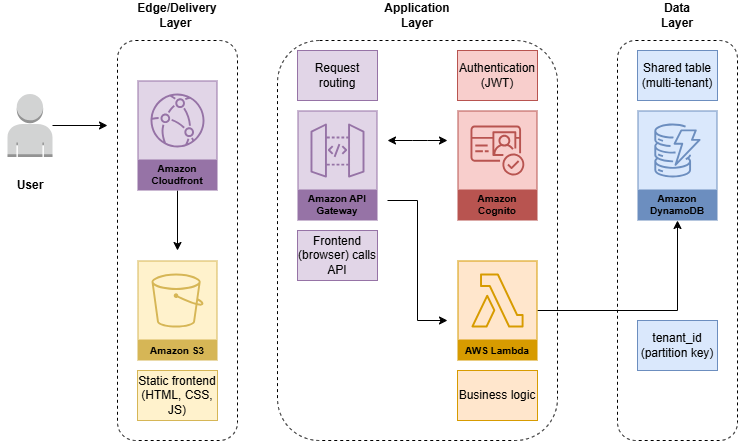

# SaaS Multi-Tenant Serverless Architecture on AWS

## Why I built this

I wanted to understand how SaaS platforms handle multiple customers without creating separate infrastructure for each one.

At first, isolating resources per client seemed safer, but it quickly becomes expensive and hard to scale. So I explored a shared (multi-tenant) architecture and the trade-offs involved.

---

## Architecture Overview



This project simulates a serverless SaaS architecture using AWS services.

---

## How it works

* Static frontend is delivered via S3 and CloudFront
* Requests are handled by API Gateway
* Cognito manages authentication
* Lambda executes business logic
* DynamoDB stores application data

Each request includes a `tenant_id`, which is used to isolate data inside a shared database.

---

## Key decisions

### Multi-tenant model

I used a pooled model, where all tenants share the same infrastructure.

This reduces cost and simplifies scaling, but requires strict control over data access.

---

### Why DynamoDB?

DynamoDB scales automatically and fits well with multi-tenant access patterns.

Using `tenant_id` as a partition key allows efficient data isolation and querying.

---

### Why serverless?

Serverless reduces operational overhead and scales automatically.

However, it introduces trade-offs such as more complex debugging and tighter coupling to the cloud provider.

---

## Project structure

```
backend/
  lambdas/
    create-item/
      index.js

infrastructure/
  terraform/
    main.tf
```

---

## Limitations

This project is not deployed in AWS. It focuses on architecture design and infrastructure definition.

In a real-world scenario, I would improve:

* observability (logs and tracing)
* tenant-level rate limiting
* billing per tenant
* stronger security controls

---

## Final thoughts

This project helped me understand that multi-tenant systems are more about architectural decisions than tools — especially when balancing cost, scalability, and data isolation.
